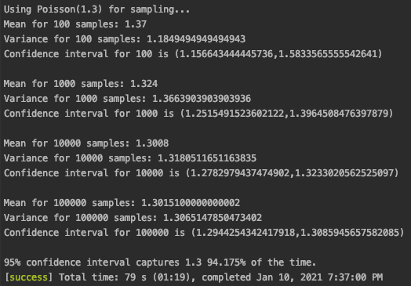

# Poisson Distribution In Scala
----------------

Example of sampling from a [Poisson distribution](https://en.wikipedia.org/wiki/Poisson_distribution) using a functional approach.
Calculating the mean, variance and confidence interval for the Poisson rate.

## Depenendencies
--------
1. [Scala 2.12.7](https://www.scala-lang.org/)
2. [SBT 1.4.4](https://www.scala-sbt.org/)
3. [OpenJDK 1.8.0](https://openjdk.java.net/)
4. [ScalaTest 3.2.2](https://www.scalatest.org/)

## Running
----------
Using sbt run the command:

	sbt run

Or

	sbt package

	scala target/scala-2.12/poissondist.12-1.0.jar

You should see the following,

